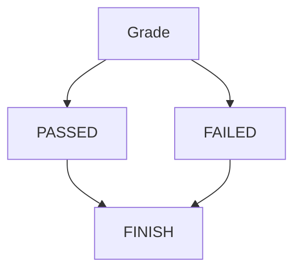

#### The IF Statment
■ Allows conditional execution of code.
 
The IF…Else selection statement allows you to specify that there is a course of
actions are to be performed when the condition is true and another course of
actions will be executed when the condition is false.
<pre>
`//For example,
   the pseudocode statement
   If student’s mark is greater than or equal to 60
   Print “Passed”
   else
   Print “Failed”
`
</pre>
`

`
■ syntax has form: 
><pre> if (expression)
>     statement1
> else
>     statement2

■ if expression expression is true, execute statement statement1; otherwise,
execute statement statement2

■ else clause can be omitted leading to simpler form:
><pre>if (expression)
>    statement1

■ conditional execution based on more than one condition can be achieved
using construct like:
> <pre>if (expression1)
>      statement1
>else if (expression2)
>      statement2
>. . .
>else
>      statementn

■ to include multiple statements in branch of if, must group statements
into single statement using brace brackets

> <pre>if (expression) {
>   statement1,1
>   statement1,2
>   statement1,3
>. . .
> } else {
>   statement2,1
>   statement2,2
>   statement2,3
>. . .
>}

■ advisable to always include brace brackets even when not necessary, as
this avoids potential bugs caused by forgetting to include brackets later
when more statements added to branch of **if** 

■ if statement may include initializer:
> <pre> if (initializer; expression)
>        statement1;
>      else
>        statement2;
■ above construct equivalent to:
><pre>{
> initializer;
> if (expression)
>    statement1;
> else
>    statement2;
>}

■ if condition in if statement is constant expression, constexpr keyword
can be added after if keyword to yield what is called constexpr-if
statement.

■ constexpr-if statement is evaluated at compile time and branch of if
statement that is not taken is discarded.

