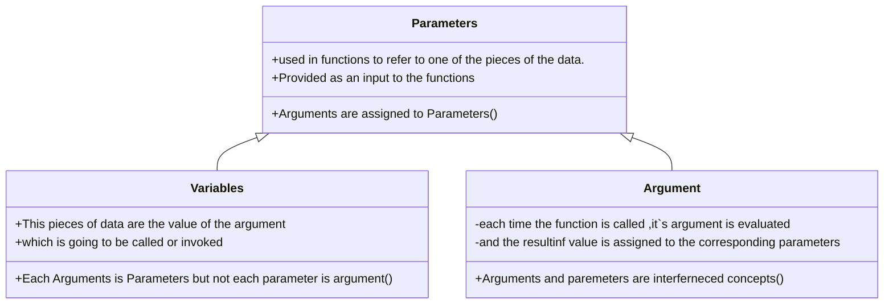

##### Parameters is special kind of variable used in subroutines to refer to one of the pieces of data provided as input to the subroutines.
>Parameters : is a variable which is part of methods signature .<br>
as Parameters = variables

#### Parameter : is a special kind of variables used in function  


| Aspect            | Parameter                                                     | Argument                                             |
|-------------------|---------------------------------------------------------------|------------------------------------------------------|
| Definitions       | A variable in the function declaration                        | The actual value passed to the function              |
| Role              | Act as a placeholder for the value that will be passed        | Provide the actual data for the function             |
| Location          | In the function definition                                    | In the Function calls                                |
| Example           | "def add(x, y)"<br>return x + y<br>'x' and 'y' are parameters | "result = add(3 , 5)"<br>3 and 5 are arguments       |
| Purpose           | To define the inputs that function expects                    | To provide the actual values to those inputs         |
| Default Values    | Can have default values ,used if no arguments is provided     | Not applicable                                       |
| Keyword Arguments | Not applicaple                                                | Can be specified by parameter name in function calls |


#### Parameters is the returning value of which is previously determined by the argument on what kind it can be and it`s value changing on the contrast of Argument which don`t have value ,Parameter does have a value
```cpp
#include<iostream>
using namespace std;
int x,y;
int third;
//notice that the more code we used it`s called bad design 
//we can gather three definition like that "int x,y,third"as it all the sametype
int swap(int a,int b);
int add(int a,int b);
int main(){
cout<<"Please Enter First Number"<<endl;
cin>>x;
cout<<"Please Enter Second  Number"<<endl;
cin>>y;
cout<<"Now The swap of them"<<"Now first number is the second which is : " <<swap(x,y)<<endl;
cout<<"Now The swap of them"<<"Now second number is the first number which is : "<<swap(y,x)<<endl;
cout<<"Please Enter Third Number "<<endl;
cin>>third;
cout<<"You want to add it to the first number or the second number? "<<endl;
cout<<"add to the first number"<< add(third,swap(x,y))<<endl;
//notice that we can pass functions as parameters to another functions
//here we passed two parameter the first number and the second parameter is the result of function swap
return 0;
}
int swap(int a,int b){
  int temp;
  a = b ;```cpp
#include<iostream>
using namespace std;
int x,y;
//declaring two types of integars called x,y
int swap(int a,int b);
// function declaration function called swap with return type integar
// function argument is a,b and we declared them before as int ,
//so this function will take two arguments each one of them is integar and swap them 
int main(){
cout<<"Please Enter First Number"<<endl;
cin>>x;
cout<<"Please Enter Second  Number"<<endl;
cin>>y;
cout<<"Now The swap of them"<<"Now first number is the second which is : " <<swap(x,y)<<endl;
cout<<"Now The swap of them"<<"Now second number is the first number which is : "<<swap(y,x)<<endl;
//here is x,y passed by value as parameters not arguemnts to calculate the sum of two integars.
//notice the difference between argument and parameters.
//As parameter is variables itself while argument is the supposed entering value
cin>>third;
cout<<"You want to add it to the first number or the second number? "<<endl;
cout<<"add to the first number"<< add(third,swap(x,y))<<endl;
return 0;
}
int swap(int a,int b){
  int temp;
  a = b ;
  b = temp;
  temp = a;
  return temp;
  // this is function definition that we declared before 
//as it will take two arguments called a,b of type integar and will return integar type variable
//which is called temp and it will be the swap of two integar .
};
int add(int a,int b){
    int c;
    c = a + b;
    return c;
};
```

